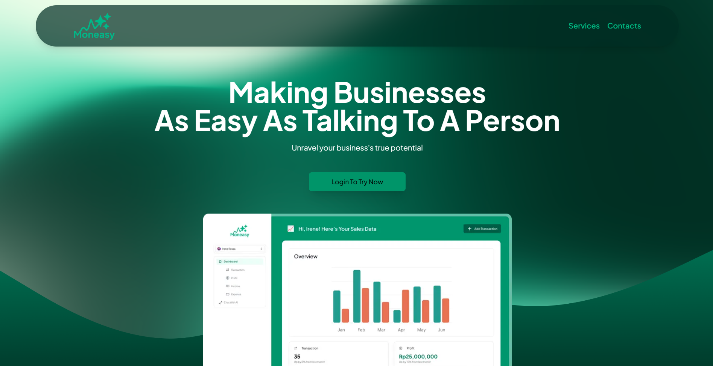
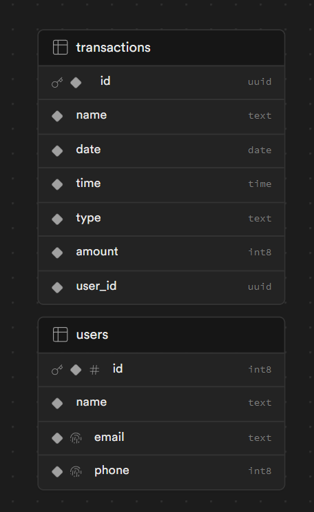

  
  <h1 align="center">Moneasy - Money Management App Integrated with AI</h1> 

<p align="center">
 Making Businesses
As Easy As Talking To A Person
</p>

<p align="center">
  <a href="#tech-stack"><strong>Tech Stack</strong></a> ·
  <a href="#features"><strong>Features</strong></a> ·
  <a href="#demo"><strong>Demo</strong></a> ·
  <a href="#clone-and-run-locally"><strong>Clone and run locally</strong></a> ·
</p>
<br/>

## Tech Stack
- Typescript
- React.js
- Next.js
- Supabase
- Tailwind
- ShadCN
- Vercel AI SDK
- Lucide React
- Recharts

## Features

- Authentication
- Landing Page
- Dashboard Page
- Data Visualization with Charts
- Add Transaction Page
- Tables view for transactions, income, and expenses, and profit
- AI Evaluation for your finances
- AI Chatbot that acts as a data analyst and helps you make better financial decisions

## Demo

You can view a fully working demo at [Our Website](https://moneasy.vercel.app/)

## Clone and run locally

1. You'll first need a Supabase project which can be made via the Supabase dashboard

2. Create a Next.js app using the Supabase Starter template npx command

   ```bash
   npx create-next-app -e with-supabase
   ```

```bash
npm run dev
# or
yarn dev
# or
pnpm dev
# or
bun dev
```

3. cd name-of-new-app

4. Rename .env.local.example to .env.local and update the following:

```bash
NEXT_PUBLIC_SUPABASE_URL=[INSERT SUPABASE PROJECT URL]
NEXT_PUBLIC_SUPABASE_ANON_KEY=[INSERT SUPABASE PROJECT API ANON KEY]
OPENAI_API_KEY=[INSERT OPENAI API KEY]
```
4. Seed The Supabase Tables
   

5. npm install

6. npm run dev

7. The app will be running at http://localhost:3000
